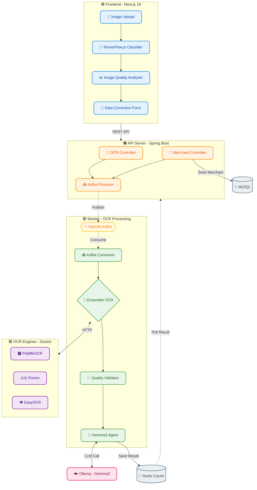
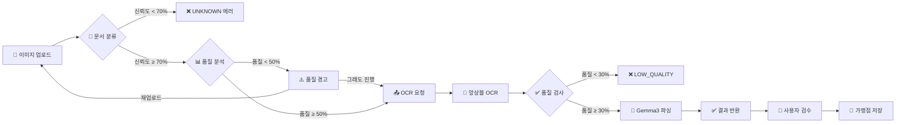

# 💼 Merchant Management System (MMS)


> 📂 **GitHub 저장소**
> - **Frontend**: [limjeahun/OCR](https://github.com/limjeahun/OCR)
> - **Backend**: 현재 저장소 ([limjeahun/Merchant-Management-System](https://github.com/limjeahun/Merchant-Management-System))

---

## 📖 개요 (Overview)

**"단순한 가맹점 등록을 넘어, AI 기반 문서 인식과 지능형 데이터 파싱을 제공하다."**

MMS는 **사업자등록증 OCR 자동 인식**을 통해 가맹점 정보를 빠르고 정확하게 등록하고, **앙상블 OCR 엔진**과 **LLM**(Gemma3)을 활용하여 **구조화된 데이터로 변환**하는 End-to-End 가맹점 관리 솔루션입니다.

**핵심 차별점:**
- 🔍 **TensorFlow.js 기반 실시간 문서 분류** (브라우저 내 추론)
- 🎯 **3-Engine Ensemble OCR** (PaddleOCR + Pororo + EasyOCR)
- 🤖 **LLM 교차 검증** (Gemma3 프롬프트 엔지니어링)
- ⚡ **이벤트 기반 비동기 처리** (Kafka)
- 🏗️ **개선된 레이어드 아키텍처** (도메인 로직 격리)

---

## 🏗️ 시스템 아키텍처 (Architecture)

개선된 레이어드 아키텍처를 적용하여 도메인 로직을 격리하고, 역할에 따라 모듈을 분리했습니다.



---

## 🔄 OCR 처리 파이프라인



---

## 💡 문제 정의 및 해결 (Case Study)

### 1️⃣ 문제: 단일 OCR 엔진의 낮은 인식률

**AS-IS**
- 한 가지 OCR 엔진만 사용하여 특정 이미지에서 인식 실패 빈번
- 흐릿한 글씨, 기울어진 문서 등에서 치명적인 오류 발생

**TO-BE**
- **앙상블 OCR 전략** 도입 (PaddleOCR + Pororo + EasyOCR)
- 3개 엔진을 **병렬 실행**하고, **LLM이 결과를 교차 검증**
- **엔진 우선순위**: Pororo > EasyOCR > PaddleOCR
- **형식 우선 선택**: 형식에 맞는 값을 우선 채택

### 2️⃣ 문제: 비문서 이미지의 잘못된 처리

**AS-IS**
- 만화, 사진 등 비문서 이미지가 문서로 분류되어 OCR 시도
- 불필요한 리소스 낭비 및 잘못된 결과 반환

**TO-BE**
- **3단계 품질 검사 체계**
  1. Frontend 분류 (신뢰도 < 70% → UNKNOWN)
  2. Frontend 품질 분석 (점수 < 50% → 경고)
  3. Backend 품질 검사 (점수 < 30% → LOW_QUALITY)

### 3️⃣ 문제: OCR 엔진 장애 시 전체 시스템 영향

**AS-IS**
- 동기 처리 구조로 OCR 엔진 1개가 장애나면 전체 요청 실패
- 처리 시간이 길어질수록 API 타임아웃 발생

**TO-BE**
- **이벤트 기반 아키텍처** (Kafka)
- API는 즉시 `requestId` 반환, Worker가 비동기 처리
- **Coroutines** 기반 병렬 OCR 실행으로 개별 엔진 장애 격리

---

## 💻 핵심 기능 (Key Features)

### 1. 실시간 문서 분류 (TensorFlow.js)
- MobileNet 기반 분류 모델
- 지원 문서: 사업자등록증, 주민등록증, 운전면허증
- 신뢰도 70% 미만 시 UNKNOWN 반환

### 2. 이미지 품질 분석
| 항목 | 가중치 | 평가 기준 |
|------|--------|-----------|
| 해상도 | 40% | < 300K px → 저품질 |
| 밝기 | 30% | 0.2 ~ 0.85 범위 최적 |
| 대비 | 30% | 표준편차 기반 |

### 3. 앙상블 OCR 품질 점수
| 항목 | 가중치 | 설명 |
|------|--------|------|
| 성공 엔진 수 | 40% | 3개 중 성공한 엔진 비율 |
| 텍스트 길이 | 30% | 평균 100자 이상 시 1.0 |
| 한글 비율 | 30% | 추출된 한글 문자 비율 |

### 4. LLM 기반 필드 파싱 (Gemma3)
```
핵심 원칙:
1. 엔진 우선순위: Pororo > EasyOCR > PaddleOCR
2. 형식 우선 선택: 각 필드마다 정해진 형식에 맞는 값을 선택
3. 형식이 맞지 않으면 다른 엔진의 값을 채택
4. Hallucination 금지 - 없는 정보 지어내지 않음
```

### 5. 지원 문서 및 추출 필드

| 문서 유형 | 추출 필드 |
|-----------|-----------|
| **사업자등록증 (개인)** | 상호, 사업자번호, 대표자명, 주소, 업태, 종목, 개업일 |
| **사업자등록증 (법인)** | 상호, 사업자번호, 법인등록번호, 대표자명, 본점/사업장 소재지, 업태, 종목 |
| **주민등록증** | 성명, 주민등록번호(마스킹), 주소, 발급일 |
| **운전면허증** | 성명, 면허번호, 면허종류, 주소, 발급일, 암호일련번호 |

---

## 🛠️ 기술 스택 (Tech Stack)

### Frontend
| 기술 | 버전 | 용도 |
|------|------|------|
| Next.js | 16.0.10 | React 프레임워크 |
| TensorFlow.js | 4.22.0 | 브라우저 내 ML 추론 |
| OpenCV.js | - | 이미지 전처리 |
| TypeScript | 5.x | 타입 안정성 |

### Backend
| 기술 | 버전 | 용도 |
|------|------|------|
| Kotlin | 1.9.25 | 메인 언어 |
| Spring Boot | 3.5.8 | API 서버 |
| Spring Kafka | - | 이벤트 처리 |
| LangChain4j | - | LLM 통합 |
| Coroutines | - | 비동기 병렬 처리 |

### Infrastructure
| 기술 | 용도 |
|------|------|
| Apache Kafka | 메시지 브로커 |
| Redis | 결과 캐싱 (TTL 10분) |
| MySQL | 가맹점 데이터 저장 |
| Docker Compose | OCR 엔진 컨테이너화 |
| Ollama | Gemma3 LLM 서빙 |

### OCR Engines
| 엔진 | 포트 | 특징 |
|------|------|------|
| PaddleOCR | 9001 | PP-OCRv5 한국어 |
| Pororo | 9004 | KakaoBrain 한국어 특화 |
| EasyOCR | 9005 | 범용 OCR |

---

## 🚀 실행 방법 (Quick Start)

### 1. Infrastructure 실행 (Docker)
```bash
cd docker
docker-compose up -d
```

### 2. Backend 서버 실행
```bash
# API 서버
./gradlew :api:bootRun

# Worker 서버 (별도 터미널)
./gradlew :worker:bootRun
```

### 3. Frontend 실행
```bash
cd ../ocr
npm install
npm run dev
```

### 4. 브라우저 접속
```
http://localhost:3000
```

---

## 📁 프로젝트 구조

```
├── Merchant-Management-System/   # Backend (Kotlin)
│   ├── api/                      # REST API 모듈
│   │   └── OcrController         # OCR 요청/결과 API
│   ├── worker/                   # Kafka Consumer 모듈
│   │   └── OcrEventConsumer      # OCR 이벤트 처리
│   ├── provider/                 # OCR 엔진 연동
│   │   ├── EnsembleOcrProvider   # 앙상블 OCR 실행
│   │   └── OcrDocumentAgent      # Gemma3 프롬프트
│   ├── domain/                   # 도메인 엔티티
│   ├── common/                   # 공통 DTO/이벤트
│   └── docker/                   # OCR Docker 설정
│
├── ocr/                          # Frontend (Next.js)
│   ├── src/
│   │   ├── components/           # React 컴포넌트
│   │   │   ├── OCRScanner.tsx    # 메인 OCR 화면
│   │   │   └── BusinessRegistrationForm.tsx
│   │   └── services/
│   │       ├── ocr/              # OCR 서비스
│   │       │   └── tensorflowService.ts  # 문서 분류/품질 분석
│   │       └── api/ocrApi.ts     # Backend API 연동
│   └── public/models/            # TensorFlow.js 모델
```

---

## 📊 API 엔드포인트

| Method | Endpoint | Description |
|--------|----------|-------------|
| POST | `/api/v1/orc/request` | OCR 요청 제출 |
| GET | `/api/v1/orc/result/{requestId}` | OCR 결과 조회 |
| POST | `/api/v1/orc/save` | 가맹점 정보 저장 |

### OCR 상태 코드
| Status | Description |
|--------|-------------|
| `PROCESSING` | 처리 중 |
| `COMPLETED` | 완료 |
| `FAILED` | 실패 |
| `LOW_QUALITY` | OCR 품질 미달 |
